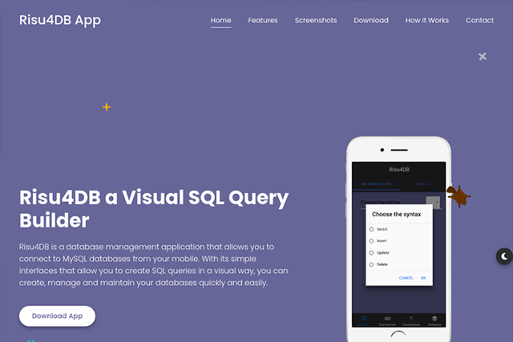

# Risu4DB Web

Risu4DB is a database management application that allows you to connect to MySQL databases from your mobile. With its simple interfaces that allow you to create SQL queries in a visual way, you can create, manage and maintain your databases quickly and easily.

## URL

[Risu4DB Web](https://rodrisolisavila.github.io/risu4db/)

